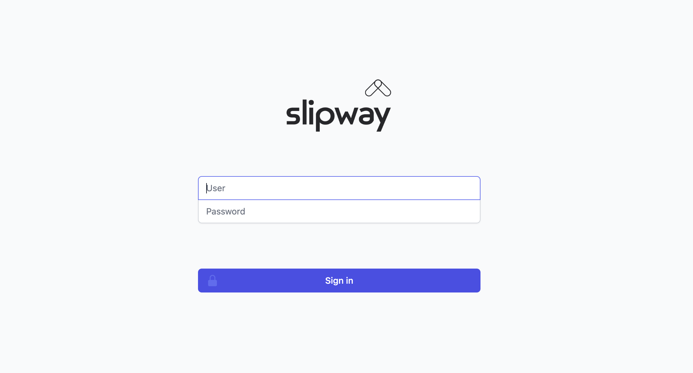
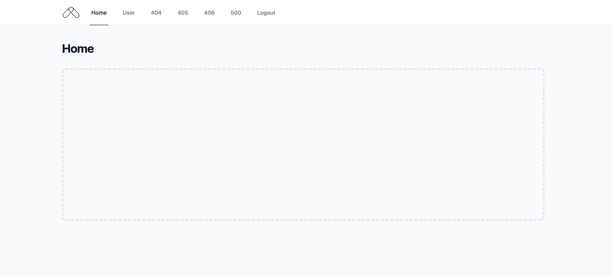

# Slipway: a Clojure companion to Jetty

[](https://github.com/operatr-io/slipway/actions/workflows/ci.yml)

### Installation

| Jetty Version | Clojars Project |
| ------------- | --------------- |
| Jetty 9 | [](https://clojars.org/io.factorhouse/slipway-jetty9) |
| Jetty 10 | [](https://clojars.org/io.factorhouse/slipway-jetty10) |
| Jetty 11 | [](https://clojars.org/io.factorhouse/slipway-jetty11) |
| Jetty 12 | Available once Jetty 12 stabilises. |

----

### Slipway by Factor House

* [Introduction](#introduction)
* [Prior Art](#prior-art)
* [Why Jetty?](#why-jetty)
* [Why Slipway?](#why-slipway)
  * [Our Requirements](#our-requirements)
  * [Primary Goals](#primary-goals)
  * [Secondary Goals](#secondary-goals)
  * [Future Goals](#future-goals)
  * [Out of Scope](#out-of-scope)
  * [Non-Goals](#non-goals)
  * [Which Version to Use?](#which-version-to-use)  
* [Using Slipway](#using-slipway)
  * [Quick Start](#quick-start)
  * [Example Servers](#example-servers)
* [Configuring Slipway](#configuring-slipway)

----



# Introduction

[Eclipse Jetty](https://www.eclipse.org/jetty/) is the web server at the heart of our product, [Kpow for Apache Kafka®](https://kpow.io).

Slipway is a [Clojure](https://clojure.org/) companion to embedded Jetty with Websocket support.

Slipway holds close to Jetty idioms for configuration rather than presenting a distinct DSL.

Use the [Community Edition](https://kpow.io/community/) of Kpow with our [local-repo](https://github.com/factorhouse/kpow-local) to see Slipway in action.

## Prior Art

Slipway is based on, and in some cases includes code from the following projects:

* [sunng87/ring-jetty9-adapter](https://github.com/sunng87/ring-jetty9-adapter) by [Ning Sun](https://github.com/sunng87)
* [ring-clojure/ring](https://github.com/ring-clojure/ring/tree/master/ring-jetty-adapter) by [James Reeves](https://github.com/weavejester)

We appreciate the great open-source work of Ning and James that forms the base of this project.

## Why Jetty?

Jetty is a mature, stable, commercially supported project with an [active, experienced](https://github.com/eclipse/jetty.project/graphs/contributors) team of core contributors.

Ubiquitous in the enterprise Java world, Jetty has many eyes raising issues and driving improvement.

Jetty is a great choice of web-server for a general purpose web-application.

## Why Slipway?

### Our Requirements

Kpow is a web-application with a SPA UI served by websockets.

We have a hard requirement to support customers on Java 8 and Java 11+.

Kpow has seemingly every possible Jetty configuration option in use by at least one end-user.

We incorporate automated NVD scanning and feedback from external security teams.

### Primary Goals

Slipway aims to provide first-class, extensible support for: 

* Core Jetty capabilities in Jetty-style
* HTTP 1.1
* HTTPS / SSL
* Synchronous handlers
* JAAS Authentication (LDAP, HashUser, etc)
* Form / basic authentication
* WebSockets
* Java 8 / 11+
* Jetty 9 / 10 / 11
* Session management
* Proxy protocol / http forwarded
* Common / sensible defaults (e.g. gzip compression)
* Configurable error handling
* Automated CVE scanning with NVD
* Comprehensive integration tests
* Ring compatibility

### Secondary Goals

* Broad support for general Jetty use-cases / configuration

### Future Goals

* Backport our SAML, OpenID and OAuth authentication implementations
* Open-source a full-stack example application using slipway in [Shortcut](https://github.com/factorhouse/shortcut).

### Out of Scope

* Http2/3
* Asynchronous Handlers
* Ajax (including auto-fallback)

### Non-Goals

* A simplified DSL for Jetty

### Which Version to Use?

* Jetty 9: If you require running with Java 8
* Jetty 10: Recommended for general use, requires Java 11+
* Jetty 11: If you want to run with Jakarta rather than Javax, requires Java 11+

## Using Slipway

### Quick Start

Choose a project by Jetty version, then open a REPL.

Start slipway with a ring-handler and a map of configuration options:

```clojure 
(require '[slipway :as slipway])
(require '[slipway.server :as server])
(require '[slipway.connector.http :as http])

(defn handler [_] {:status 200 :body "Hello world"})

(def http-connector #::http{:port 3000})

(slipway/start handler #::server{:connectors [http-connector]})
```

Your hello world application is now running on [http://localhost:3000](http://localhost:3000).

### Example Servers

Various configuration of Slipway can be found in the [example.clj](common/test/slipway/example.clj) namespace.

The stateful start!/stop! functions within that namespace are not considered canonical for Slipway, they are a convenience for our integration tests. 

```clojure
(require '[slipway.example :as example])

(example/start! [:http :hash-auth])
```

Your sample application with [property file based authz](https://docs.kpow.io/authentication/file/) is now available on [http://localhost:3000](http://localhost:3000).

Login with jetty/jetty, admin/admin, plain/plain, other/other, or user/password as defined in [hash-realm.properties](common/dev-resources/jaas/hash-realm.properties).

After login the default home-page presents some useful links for user info and error pages.

-----



## Configuring Slipway

Slipway is configured with maps of namespaced-keys.

```clojure
  #:slipway.handler.gzip{:enabled?            "is gzip enabled? default true"
                         :included-mime-types "mime types to include (without charset or other parameters), leave nil for default types"
                         :excluded-mime-types "mime types to exclude (replacing any previous exclusion set)"
                         :min-gzip-size       "min response size to trigger dynamic compression (in bytes, default 1024)"}

  #:slipway.connector.https{:host                       "the network interface this connector binds to as an IP address or a hostname.  If null or 0.0.0.0, then bind to all interfaces. Default null/all interfaces"
                            :port                       "port this connector listens on. If set to 0 a random port is assigned which may be obtained with getLocalPort(), default 443"
                            :idle-timeout               "max idle time for a connection, roughly translates to the Socket.setSoTimeout. Default 200000 ms"
                            :http-forwarded?            "if true, add the ForwardRequestCustomizer. See Jetty Forward HTTP docs"
                            :proxy-protocol?            "if true, add the ProxyConnectionFactor. See Jetty Proxy Protocol docs"
                            :http-config                "a concrete HttpConfiguration object to replace the default config entirely"
                            :configurator               "a fn taking the final connector as argument, allowing further configuration"
                            :keystore                   "keystore to use, either path (String) or concrete KeyStore"
                            :keystore-type              "type of keystore, e.g. JKS"
                            :keystore-password          "password of the keystore"
                            :key-manager-password       "password for the specific key within the keystore"
                            :truststore                 "truststore to use, either path (String) or concrete KeyStore"
                            :truststore-password        "password of the truststore"
                            :truststore-type            "type of the truststore, eg. JKS"
                            :include-protocols          "a list of protocol name patterns to include in SSLEngine"
                            :exclude-protocols          "a list of protocol name patterns to exclude from SSLEngine"
                            :replace-exclude-protocols? "if true will replace existing exclude-protocols, otherwise will add them"
                            :exclude-ciphers            "a list of cipher suite names to exclude from SSLEngine"
                            :replace-exclude-ciphers?   "if true will replace existing exclude-ciphers, otherwise will add them"
                            :security-provider          "the security provider name"
                            :client-auth                "either :need or :want to set the corresponding need/wantClientAuth field"
                            :ssl-context                "a concrete pre-configured SslContext"
                            :sni-required?              "true if a SNI certificate is required, default false"
                            :sni-host-check?            "true if the SNI Host name must match, default false"}

  #:slipway.connector.http{:host            "the network interface this connector binds to as an IP address or a hostname.  If null or 0.0.0.0, then bind to all interfaces. Default null/all interfaces."
                           :port            "port this connector listens on. If set to 0 a random port is assigned which may be obtained with getLocalPort(), default 80"
                           :idle-timeout    "max idle time for a connection, roughly translates to the Socket.setSoTimeout. Default 200000 ms"
                           :http-forwarded? "if true, add the ForwardRequestCustomizer. See Jetty Forward HTTP docs"
                           :proxy-protocol? "if true, add the ProxyConnectionFactory. See Jetty Proxy Protocol docs"
                           :http-config     "a concrete HttpConfiguration object to replace the default config entirely"
                           :configurator    "a fn taking the final connector as argument, allowing further configuration"}

  #:slipway.authz{:realm               "the Jetty authentication realm"
                  :hash-user-file      "the path to a Jetty Hash User File"
                  :login-service       "pluggable Jetty LoginService identifier, 'jaas' and 'hash' supported by default"
                  :authenticator       "a concrete Jetty Authenticator (e.g. FormAuthenticator or BasicAuthenticator)"
                  :constraint-mappings "a list of concrete Jetty ConstraintMapping"}

  #:slipway.session{:secure-request-only?  "set the secure flag on session cookies (default true)"
                    :http-only?            "set the http-only flag on session cookies (default true)"
                    :same-site             "set session cookie same-site policy to :none, :lax, or :strict (default :strict)"
                    :max-inactive-interval "max session idle time (in s, default -1)"
                    :tracking-modes        "a set (colloection) of #{:cookie, :ssl, or :url}"
                    :cookie-name           "the name of the session cookie"
                    :session-id-manager    "the meta manager used for cross context session management"
                    :refresh-cookie-age    "max time before a session cookie is re-set (in s)"
                    :path-parameter-name   "name of path parameter used for URL session tracking"}

  ;; Jetty 10 / Jetty 11 Websockets
  #:slipway.websockets{:idle-timeout            "max websocket idle time (in ms), default 500000"
                       :input-buffer-size       "max websocket input buffer size (in bytes)"
                       :output-buffer-size      "max websocket output buffer size (in bytes)"
                       :max-text-message-size   "max websocket text message size (in bytes, default 65536)"
                       :max-binary-message-size "max websocket binary message size (in bytes)"
                       :max-frame-size          "max websocket frame size (in bytes)"
                       :auto-fragment           "websocket auto fragment (boolean)"}

  ;; Jetty 9 Websockets
  #:slipway.websockets{:idle-timeout            "max websocket idle time (in ms), default 500000"
                       :input-buffer-size       "max websocket input buffer size"
                       :max-text-message-size   "max websocket text message size"
                       :max-binary-message-size "max websocket binary message size"}

  #:slipway.handler{:context-path    "the root context path, default '/'"
                    :ws-path         "the path serving the websocket upgrade handler, default '/chsk'"
                    :null-path-info? "true if /path is not redirected to /path/, default true"}

  #:slipway.server{:handler       "the base Jetty handler implementation (:default defmethod impl found in slipway.handler)"
                   :connectors    "the connectors supported by this server"
                   :thread-pool   "the thread-pool used by this server (leave null for reasonable defaults)"
                   :error-handler "the error-handler used by this server for Jetty level errors"}

  #:slipway{:join? "join the Jetty threadpool, blocks the calling thread until jetty exits, default false"}
```

### TBD Below this line is out of date, will be updated shortly.
----

### WebSockets

Slipway provides the same API as the [ring-jetty9-adapter](https://github.com/sunng87/ring-jetty9-adapter) for upgrading HTTP requests to WebSockets. 

```clojure 
(require '[slipway.websockets :as ws])
(require '[slipway.server :as slipway])

(def ws-handler {:on-connect (fn [ws] (ws/send! ws "Hello world"))
                 :on-error (fn [ws e])
                 :on-close (fn [ws status-code reason])
                 :on-text (fn [ws text-message])
                 :on-bytes (fn [ws bytes offset len])
                 :on-ping (fn [ws bytebuffer])
                 :on-pong (fn [ws bytebuffer])})

(defn handler [req]
  (if (ws/upgrade-request? req)
    (ws/upgrade-response ws-handler)
    {:status 406}))
    
(slipway/run-jetty handler {:port 3000 :join? false})
```

The `ws` object passed to each handler function implements the `slipway.websockets.WebSockets` protocol:

```clojure 
(defprotocol WebSockets
  (send! [this msg] [this msg callback])
  (ping! [this] [this msg])
  (close! [this] [this status-code reason])
  (remote-addr [this])
  (idle-timeout! [this ms])
  (connected? [this])
  (req-of [this]))
```

#### Sente Integration

Slipway supports [Sente](https://github.com/ptaoussanis/sente) out-of-the box. 

Include Sente in your project's dependencies and follow Sente's [getting started guide](https://github.com/ptaoussanis/sente#getting-started), and use the slipway web-server adapter:

```clojure 
(require '[slipway.sente :refer [get-sch-adapter]])
```

### JAAS integration

JAAS implements a Java version of the standard Pluggable Authentication Module (PAM) framework.

JAAS can be used for two purposes:

* for authentication of users, to reliably and securely determine who is currently executing Java code
* for authorization of users to ensure they have the access control rights (permissions) required to do the actions performed.

For more information visit the [Jetty documentation](https://www.eclipse.org/jetty/documentation/jetty-10/operations-guide/index.html#og-jaas).

#### Usage

TODO

#### jaas.config

Start your application (JAR or REPL session) with the additional JVM opt `-Djava.security.auth.login.config=/some/path/to/jaas.config`

For example configurations refer to [this tutorial](https://wiki.eclipse.org/Jetty/Tutorial/JAAS#Configuring_a_JAASLoginService)

#### Hash realm authentication

The simplest JAAS authentication module. A static list of hashed users in a file. 

Example `jaas.config`: ('my-app' must be the same as the configured :realm)

``` 
my-app {
           org.eclipse.jetty.jaas.spi.PropertyFileLoginModule required
           debug="true"
           file="dev-resources/jaas/hash-realm.properties";
       };
```

Example `hash-realm.properties`:

```
# This file defines users passwords and roles for a HashUserRealm
#
# The format is
#  <username>: <password>[,<rolename> ...]
#
# Passwords may be clear text, obfuscated or checksummed.  The class
# org.eclipse.jetty.util.security.Password should be used to generate obfuscated
# passwords or password checksums
#
# If DIGEST Authentication is used, the password must be in a recoverable
# format, either plain text or OBF:.
#
jetty: MD5:164c88b302622e17050af52c89945d44,kafka-users,content-administrators
admin: CRYPT:adpexzg3FUZAk,server-administrators,content-administrators,kafka-admins
other: OBF:1xmk1w261u9r1w1c1xmq,kafka-admins,kafka-users
plain: plain,content-administrators
user: password,kafka-users
# This entry is for digest auth.  The credential is a MD5 hash of username:realmname:password
digest: MD5:6e120743ad67abfbc385bc2bb754e297,kafka-users
```

#### LDAP authentication

Example `jaas.config`:

``` 
ldaploginmodule {
   org.eclipse.jetty.plus.jaas.spi.LdapLoginModule required
   debug="true"
   contextFactory="com.sun.jndi.ldap.LdapCtxFactory"
   hostname="ldap.example.com"
   port="389"
   bindDn="cn=Directory Manager"
   bindPassword="directory"
   authenticationMethod="simple"
   forceBindingLogin="false"
   userBaseDn="ou=people,dc=alcatel"
   userRdnAttribute="uid"
   userIdAttribute="uid"
   userPasswordAttribute="userPassword"
   userObjectClass="inetOrgPerson"
   roleBaseDn="ou=groups,dc=example,dc=com"
   roleNameAttribute="cn"
   roleMemberAttribute="uniqueMember"
   roleObjectClass="groupOfUniqueNames";
   };
```

## Examples

Check back soon! 

## License

Distributed under the MIT License.

Copyright (c) 2022 Factor House
